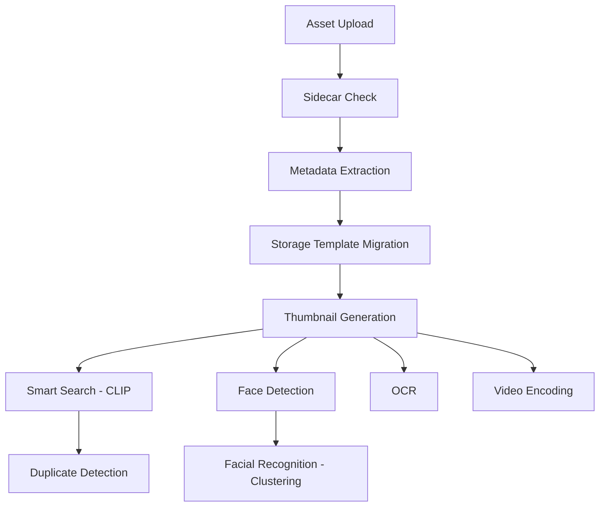

# Track E Extension: OCR, Face Recognition & Duplicate Detection

> **Living Documentation** - Update this file as features are implemented.
> Last Updated: 2026-01-02

---

## Executive Summary

**Status Update**: Face recognition is **95% complete** and **Duplicate Detection is 100% complete**. Only Person Management (clustering with names) and OCR remain as features to implement.

Your triton-api has **significant performance advantages** over Immich (3-5x faster) due to DALI GPU preprocessing and TensorRT. This plan adds Immich's missing features while maintaining that advantage.

**User Requirements:**
- Implement ALL THREE features (OCR, Face Recognition, Duplicates)
- OCR with bounding boxes for visual highlighting
- Full person management (auto-cluster, naming like Google Photos)
- Extend Track E (unified API)
- Use **imohash** for fast image hashing (not SHA256)

**Estimated Remaining Time: 4-5 days** (Duplicate Detection complete, OCR + Person Management remain)

---

## Feature Checklist & Progress Tracking

| Feature | Status | Notes |
|---------|--------|-------|
| **Face Detection (SCRFD)** | ✅ Deployed | `models/scrfd_10g_face_detect/` |
| **Face Embeddings (ArcFace)** | ✅ Deployed | `models/arcface_w600k_r50/` |
| **Face Pipeline BLS** | ✅ Deployed | `models/face_pipeline/` (6 instances, dynamic batching) |
| **Quad DALI Preprocessing** | ✅ Deployed | `models/quad_preprocess_dali/` - 4 branches |
| **Unified Ensemble** | ✅ Deployed | `models/yolo_face_clip_ensemble/` |
| **Face API Endpoints** | ✅ Complete | `/faces/detect`, `/faces/recognize`, `/faces/full`, `/faces/verify`, `/faces/ingest` |
| **Face Ingestion** | ✅ Complete | Ingests to `visual_search_faces` index |
| **FAISS IVF Clustering** | ✅ Complete | Multi-index clustering for faces, people, vehicles |
| **Person Management** | 🟡 Partial | Need: naming, merge, split, person index |
| **OCR Detection Model** | ⬜ Not Started | PP-OCRv5 TensorRT export |
| **OCR Recognition Model** | ⬜ Not Started | PP-OCRv5 TensorRT export |
| **OCR API Endpoints** | ⬜ Not Started | Search by text in image |
| **Duplicate Detection** | ✅ Complete | imohash + CLIP similarity grouping |
| **Job Queue (Optional)** | ⬜ Not Started | Async processing like Immich |

---

## Architecture Comparison: Triton-API vs Immich

| Aspect | Triton-API | Immich ML | Winner |
|--------|-----------|-----------|--------|
| Model Serving | NVIDIA Triton + TensorRT | ONNX Runtime | Triton (2-3x faster) |
| Preprocessing | DALI (100% GPU) | OpenCV/PIL (CPU) | Triton (4-5x faster) |
| Batching | Dynamic batching (max 128) | Manual batching | Triton |
| Vector DB | OpenSearch + FAISS IVF | PostgreSQL + pgvector | Comparable (different trade-offs) |
| Face Detection | SCRFD 10G (TRT) | RetinaFace (ONNX) | Triton (faster) |
| Face Embedding | ArcFace R50 (TRT) | ArcFace (ONNX) | Triton (faster) |
| Face Pipeline | Unified BLS (single call) | Separate calls | Triton (less overhead) |
| CLIP Embedding | MobileCLIP S2 (TRT) | Various (ONNX) | Triton (faster) |
| OCR | **MISSING** | PaddleOCR v5 (RapidOCR) | Immich |
| Person Management | 🟡 Partial (clustering works) | Full (naming, merge, split) | Immich |
| Hashing | imohash (48KB sampled, ~1ms) | SHA-1 (full file read) | **Triton** (faster) |
| Job Queue | **MISSING** (sync only) | BullMQ/Redis | Immich (reliability) |
| Duplicate Detection | imohash + CLIP (threshold=0.99) | CLIP similarity (maxDistance=0.01) | **Tie** (same threshold) |

---

## Immich Processing Pipeline Analysis

### Job Flow (From Immich Source Code)



**Key Insights from `job.service.ts`:**

1. **Parallel ML Jobs**: After thumbnails, Immich runs SmartSearch + FaceDetection + OCR **in parallel**
2. **Sequential Dependencies**: Duplicate detection waits for CLIP embeddings
3. **Deferred Face Recognition**: Non-core faces (few matches) are deferred for later processing
4. **Nightly Clustering**: Face clustering runs nightly, skips if no new faces since last run

### Immich Hashing Strategy (From `crypto.repository.ts`)

```typescript
// Immich uses SHA-1 for file checksums (not imohash)
hashSha1(value: string | Buffer): Buffer {
  return createHash('sha1').update(value).digest();
}

// Checksum computed on full file upload
// Used for exact duplicate detection during upload
```

**Implications for Triton-API:**
- SHA-1 is slow for large files (reads entire file)
- imohash is better for our use case (constant time, 48KB sampled)
- However, Immich uses CLIP similarity for near-duplicates (same as our plan)

### Immich Duplicate Detection (From `duplicate.service.ts`)

```typescript
// Search for similar embeddings within threshold
const duplicateAssets = await this.duplicateRepository.search({
  assetId: asset.id,
  embedding: asset.embedding,
  maxDistance: machineLearning.duplicateDetection.maxDistance, // Configurable
  type: asset.type,
  userIds: [asset.ownerId],
});
```

**Key Design Decisions:**
- Uses CLIP embeddings (not perceptual hash like pHash/dHash)
- Groups duplicates with `duplicateId` field
- Configurable distance threshold via admin settings

### Immich Face Recognition (From `person.service.ts`)

```typescript
// Core vs Non-Core faces
const isCore = matches.length >= machineLearning.facialRecognition.minFaces &&
               face.asset.visibility === AssetVisibility.Timeline;

// Deferred processing for non-core faces
if (!isCore && !deferred) {
  await this.jobRepository.queue({
    name: JobName.FacialRecognition,
    data: { id, deferred: true }
  });
  return JobStatus.Skipped;
}
```

**Key Features:**
- **minFaces threshold**: Requires N matches before creating person (avoids noise)
- **Deferred processing**: Non-core faces processed after queue clears
- **Person merging**: Manual merge with name/birthdate inheritance
- **Representative face**: Each person has a thumbnail face

### Immich OCR (From `ocr.service.ts`)

```typescript
// Uses preview image, not original (faster)
const ocrResults = await this.machineLearningRepository.ocr(
  asset.previewFile,
  machineLearning.ocr
);

// Stores bounding boxes + text
const ocrDataList = [];
for (let i = 0; i < text.length; i++) {
  ocrDataList.push({
    assetId: id,
    x1: box[boxOffset], y1: box[boxOffset + 1], ...
    text: rawText,
  });
}

// Tokenizes for search
searchTokens.push(...tokenizeForSearch(rawText));
```

**Key Features:**
- Uses preview (smaller) for speed
- Stores quad bounding boxes (8 coordinates per box)
- Trigram tokenization for fuzzy search

---

## What We Already Have (Implemented)

### Deployed Models (From `models/` Directory)

| Model | Purpose | Performance |
|-------|---------|-------------|
| `scrfd_10g_face_detect` | Face detection | TensorRT, ~5ms |
| `arcface_w600k_r50` | Face embeddings (512-dim) | TensorRT, ~3ms |
| `face_pipeline` | Unified face processing | Python BLS, 6 instances |
| `quad_preprocess_dali` | 4-branch preprocessing | GPU, ~1ms |
| `yolo_face_clip_ensemble` | Combined inference | All models in one call |
| `unified_embedding_extractor` | Scene + face embeddings | Flexible output |
| `scrfd_postprocess` | Face NMS + alignment | Python backend |

### Deployed API Endpoints (From `track_e.py`)

| Endpoint | Status | Description |
|----------|--------|-------------|
| `/track_e/faces/detect` | ✅ | Face detection only |
| `/track_e/faces/recognize` | ✅ | Detection + embeddings |
| `/track_e/faces/full` | ✅ | Full pipeline with quality |
| `/track_e/faces/verify` | ✅ | Compare two face images |
| `/track_e/faces/ingest` | ✅ | Ingest faces to OpenSearch |
| `/track_e/unified` | ✅ | YOLO + CLIP + Faces in one call |
| `/track_e/clusters/*` | ✅ | FAISS IVF clustering endpoints |
| `/track_e/albums` | ✅ | List cluster albums |
| `/track_e/maintenance/*` | ✅ | Cluster rebalancing |

### Deployed OpenSearch Indexes

| Index | Status | Fields |
|-------|--------|--------|
| `visual_search_global` | ✅ | Scene CLIP embeddings |
| `visual_search_faces` | ✅ | Face ArcFace embeddings |
| `visual_search_people` | ✅ | Person boxes (YOLO class 0) |
| `visual_search_vehicles` | ✅ | Vehicle boxes |

---

## Phase 1: Person Management (Face Infra Complete!)

**Status: 95% Complete - Only Person Naming/Management Needed**
**Time Estimate: 1 day**

### What's Already Working

| Component | Status | Notes |
|-----------|--------|-------|
| Face Detection | ✅ | SCRFD 10G TensorRT |
| Face Embeddings | ✅ | ArcFace R50 TensorRT |
| Face Pipeline | ✅ | Python BLS with Umeyama alignment |
| Face API Endpoints | ✅ | `/faces/detect`, `/recognize`, `/full`, `/verify` |
| Face Ingestion | ✅ | Stores to `visual_search_faces` |
| FAISS IVF Clustering | ✅ | Auto-clusters by similarity |

### What's Missing: Person Management

The key difference from Immich is **named person entities**. Currently we have:
- ✅ Face embeddings stored per-image
- ✅ Similarity search across all faces
- ❌ Named "Person" entities (like "John Smith")
- ❌ Merge/split operations for incorrect groupings
- ❌ Representative face thumbnails

### Files to Create/Modify

| File | Action | Description |
|------|--------|-------------|
| `src/services/person_management.py` | **Create** | Person CRUD + naming logic |
| `src/routers/track_e.py` | Modify | Add person management endpoints |
| `src/clients/opensearch.py` | Modify | Add `visual_search_persons` index |

### New Person Management API Endpoints

```python
# Person CRUD (like Immich person.service.ts)
GET  /track_e/persons                 # List all persons (with face count)
GET  /track_e/persons/{person_id}     # Get person details + sample faces
POST /track_e/persons                 # Create person manually
PUT  /track_e/persons/{person_id}     # Update name/birthDate/isHidden
DELETE /track_e/persons/{person_id}   # Delete person (unlinks faces)

# Person Operations
POST /track_e/persons/merge           # Merge persons (like Immich mergePerson)
POST /track_e/persons/{id}/split      # Split incorrectly grouped faces
POST /track_e/persons/{id}/thumbnail  # Set representative face

# Face-to-Person Assignment
POST /track_e/faces/{face_id}/assign  # Manually assign face to person
POST /track_e/faces/auto-cluster      # Run clustering to create persons
GET  /track_e/faces/unassigned        # Get faces without person
```

### OpenSearch: New Person Index

```json
// visual_search_persons (NEW)
{
  "mappings": {
    "properties": {
      "person_id": { "type": "keyword" },
      "name": { "type": "keyword" },
      "name_source": { "type": "keyword" },
      "face_count": { "type": "integer" },
      "representative_face_id": { "type": "keyword" },
      "representative_embedding": { "type": "knn_vector", "dimension": 512 },
      "created_at": { "type": "date" },
      "updated_at": { "type": "date" }
    }
  },
  "settings": { "index.knn": true }
}
```

### Person Clustering Algorithm

```python
# src/services/person_management.py
class PersonManagementService:
    SIMILARITY_THRESHOLD = 0.7  # Cosine similarity for same person
    MIN_FACES_FOR_PERSON = 2    # Minimum faces to create person

    async def cluster_faces(self, batch_size: int = 1000):
        """
        Cluster unclustered faces into persons:
        1. Get all faces without person_id
        2. For each face:
           a. Search existing persons (representative_embedding)
           b. If similarity > 0.7, assign to that person
           c. If no match, create new person or leave unassigned
        """

    async def merge_persons(self, person_id_1: str, person_id_2: str) -> str
    async def split_person(self, person_id: str, face_ids: list[str]) -> str
```

---

## Phase 2: OCR Implementation

**Status: Full Implementation Needed**
**Time Estimate: 3-5 days**

### Model Export Strategy

```
models/
├── paddleocr_det_trt/          # TensorRT detection model
│   ├── 1/model.plan
│   └── config.pbtxt
├── paddleocr_rec_trt/          # TensorRT recognition model
│   ├── 1/model.plan
│   └── config.pbtxt
├── ocr_preprocess_dali/        # DALI preprocessing
│   ├── 1/model.dali
│   └── config.pbtxt
└── ocr_pipeline/               # Python BLS orchestrator
    ├── 1/model.py
    └── config.pbtxt
```

### Files to Create

| File | Description |
|------|-------------|
| `export/download_paddleocr.py` | Download PaddleOCR v5 ONNX models |
| `export/export_paddleocr.py` | Convert to TensorRT |
| `models/ocr_pipeline/1/model.py` | Python BLS for OCR pipeline |
| `models/ocr_preprocess_dali/1/model.dali` | DALI preprocessing |
| `src/services/ocr_service.py` | OCR service wrapper |

### OpenSearch: OCR Index

```json
// visual_search_ocr (NEW)
{
  "settings": {
    "analysis": {
      "analyzer": {
        "trigram_analyzer": {
          "type": "custom",
          "tokenizer": "standard",
          "filter": ["lowercase", "trigram_filter"]
        }
      },
      "filter": {
        "trigram_filter": { "type": "ngram", "min_gram": 3, "max_gram": 3 }
      }
    }
  },
  "mappings": {
    "properties": {
      "ocr_id": { "type": "keyword" },
      "image_id": { "type": "keyword" },
      "image_path": { "type": "keyword" },
      "text": { "type": "text", "analyzer": "trigram_analyzer" },
      "confidence": { "type": "float" },
      "box": { "type": "float" },
      "language": { "type": "keyword" }
    }
  }
}
```

### New OCR API Endpoints

```python
POST /track_e/ocr/predict          # Extract text + bounding boxes
POST /track_e/ocr/predict_batch    # Batch OCR processing
POST /track_e/search/ocr           # Search images by text content
GET  /track_e/ocr/{image_id}       # Get OCR results for an image
```

---

## Phase 3: Duplicate Detection ✅ COMPLETE

**Status: Fully Implemented**

### Implementation Strategy

**Exact Duplicates:** imohash (fast constant-time hash) ✅ **COMPLETE**
**Near Duplicates:** CLIP embedding similarity (configurable threshold) ✅ **COMPLETE**

### Schema Extension ✅ COMPLETE

Added to `visual_search_global`:
```json
{
  "imohash": { "type": "keyword" },
  "file_size_bytes": { "type": "long" },
  "duplicate_group_id": { "type": "keyword" },
  "is_duplicate_primary": { "type": "boolean" },
  "duplicate_score": { "type": "float" }
}
```

### Implemented Features ✅

| Feature | Status | Description |
|---------|--------|-------------|
| imohash on ingest | ✅ | Computed and stored for every image |
| `skip_duplicates` parameter | ✅ | `/track_e/ingest?skip_duplicates=true` (default) |
| Duplicate check on ingest | ✅ | Returns existing image info if hash matches |
| Benchmark mode | ✅ | `client_ingest.py --benchmark` disables check |
| Near-duplicate search | ✅ | CLIP similarity k-NN search |
| Duplicate grouping | ✅ | Auto-group similar images |
| Group management | ✅ | Merge, split, remove from groups |

### Duplicate API Endpoints ✅ COMPLETE

```python
# Find duplicates
POST /track_e/duplicates/find           # Find near-duplicates for an image ID
POST /track_e/duplicates/find_by_image  # Find duplicates by uploading image
POST /track_e/duplicates/scan           # Scan index and create groups

# Manage groups
GET  /track_e/duplicates/groups                           # List all groups
GET  /track_e/duplicates/group/{group_id}                 # Get group members
DELETE /track_e/duplicates/group/{group_id}/member/{id}   # Remove from group
POST /track_e/duplicates/groups/merge                     # Merge groups

# Statistics
GET  /track_e/duplicates/stats          # Get duplicate statistics
```

### Threshold Guide (Immich Comparison)

**Default threshold: 0.99** (matches Immich's `maxDistance=0.01`)

Immich uses cosine **distance** (lower = more similar), we use cosine **similarity** (higher = more similar):
- `distance = 1 - similarity`
- Immich `maxDistance=0.01` → our `threshold=0.99`

| Threshold | Description | Use Case |
|-----------|-------------|----------|
| **0.99** | Nearly identical (Immich default) | Crops, resizes, compression |
| 0.95-0.98 | Very similar | Same scene, slight variations |
| 0.90-0.95 | Similar content | Same subject, different angle |
| <0.90 | Related | Different images, similar theme |

### Auto-Assignment During Ingestion

Near-duplicates are automatically detected and grouped during `/track_e/ingest`:
```python
POST /track_e/ingest
    ?detect_near_duplicates=true  # Default: True
    &near_duplicate_threshold=0.99  # Default: 0.99 (Immich-compatible)
```

**No periodic retraining required** - unlike FAISS IVF, k-NN duplicate detection is real-time.

---

## Phase 4: Unified Ingestion Pipeline

**Time Estimate: 1-2 days**

### Enhanced /ingest Endpoint

```python
@router.post('/ingest')
async def ingest_image_full(
    file: UploadFile,
    image_id: str | None = None,
    enable_ocr: bool = True,        # NEW
    enable_faces: bool = True,       # NEW
    enable_duplicates: bool = True,  # NEW
):
    """
    Full ingestion pipeline:
    1. Calculate imohash (duplicate check)
    2. Run unified ensemble (YOLO + CLIP + Face + OCR)
    3. Index to appropriate stores:
       - global_embedding -> visual_search_global
       - boxes by class -> visual_search_vehicles/people
       - face embeddings -> visual_search_faces (+ person assignment)
       - OCR text -> visual_search_ocr
       - hash -> visual_search_global.imohash
    """
```

### Throughput Targets

- 64 images/batch
- ~100 images/second sustained
- 1M images in ~3 hours

---

## Updated Implementation Schedule

| Phase | Task | Time | Status | Dependencies |
|-------|------|------|--------|--------------|
| **1.1** | Face detection/embedding endpoints | - | ✅ Complete | - |
| **1.2** | Face ingestion + clustering | - | ✅ Complete | - |
| **1.3** | Person management service | 4h | ⬜ TODO | None |
| **1.4** | Person API endpoints | 2h | ⬜ TODO | 1.3 |
| **1.5** | Person OpenSearch index | 2h | ⬜ TODO | 1.3 |
| **2.1** | Download/export PaddleOCR | 4h | ⬜ TODO | None |
| **2.2** | OCR TensorRT conversion | 4h | ⬜ TODO | 2.1 |
| **2.3** | OCR Python BLS backend | 6h | ⬜ TODO | 2.2 |
| **2.4** | OCR DALI preprocessing | 4h | ⬜ TODO | 2.1 |
| **2.5** | OCR OpenSearch index | 2h | ⬜ TODO | 2.3 |
| **2.6** | OCR API endpoints | 3h | ⬜ TODO | 2.5 |
| **3.1** | imohash integration | 2h | ✅ Done | None |
| **3.2** | Near-duplicate detection (CLIP) | 4h | ✅ Done | 3.1 |
| **3.3** | Duplicate grouping/merge API | 2h | ✅ Done | 3.2 |
| **4.1** | Unified ingestion pipeline | 4h | ⬜ TODO | 1-3 |
| **4.2** | Batch ingestion optimization | 4h | ⬜ TODO | 4.1 |

**Remaining: ~31 hours (4-5 days)**

### Parallel Work Streams

```
Stream A (Person Management):  1.3 → 1.4 → 1.5  (~8h)
Stream B (OCR):                2.1 → 2.2 → 2.3 → 2.4 → 2.5 → 2.6  (~23h)
Stream C (Duplicates):         ✅ COMPLETE (imohash + CLIP near-duplicates)
Stream D (Integration):        4.1 → 4.2  (~8h, depends on A-B)
```

**With parallel execution: 3-4 days**

---

## Critical Files Summary

| File | Purpose | Status |
|------|---------|--------|
| `src/routers/track_e.py` | All Track E endpoints | ✅ Exists (extend) |
| `src/services/visual_search.py` | Visual search + clustering | ✅ Exists (extend) |
| `src/clients/opensearch.py` | OpenSearch client | ✅ Exists (extend) |
| `src/services/person_management.py` | **NEW** - Person CRUD + naming | ⬜ Create |
| `src/services/ocr_service.py` | **NEW** - OCR inference wrapper | ⬜ Create |
| `src/services/duplicate_detection.py` | Duplicate detection service | ✅ Complete |
| `models/ocr_pipeline/1/model.py` | **NEW** - OCR Python BLS | ⬜ Create |
| `export/export_paddleocr.py` | **NEW** - PaddleOCR TRT export | ⬜ Create |

---

## Best Practices from Immich to Adopt

### 1. Job Queue for Reliability (Optional Enhancement)

Immich uses BullMQ/Redis for job queuing. While our sync approach works, a job queue provides:

| Benefit | How Immich Does It | Our Equivalent |
|---------|-------------------|----------------|
| **Retry on failure** | BullMQ auto-retry | Manual retry in API |
| **Rate limiting** | Queue concurrency | Triton dynamic batching |
| **Progress tracking** | Job status events | Streaming response |
| **Deferred processing** | `deferred: true` flag | Batch endpoints |

**Recommendation**: Consider adding a lightweight job queue (e.g., `arq` with Redis) for:
- Large batch ingestion (1000+ images)
- Background cluster rebalancing
- Nightly maintenance tasks

### 2. Deferred Face Recognition (Adopt)

Immich's clever optimization for noisy faces:

```python
# Only cluster "core" faces (multiple matches) immediately
# Defer single/few-match faces for later processing
if matches < MIN_FACES_FOR_PERSON and not deferred:
    queue.add(face_id, deferred=True)
    return "skipped"
```

**Benefit**: Reduces noise in person clusters, faster initial ingestion.

### 3. Preview Image for OCR (Adopt)

Immich runs OCR on preview (smaller) images, not originals:
- Faster processing
- Good enough for text detection
- Original only needed for high-res crop if required

### 4. Trigram Search for OCR (Adopt)

Immich tokenizes OCR text with trigrams for fuzzy matching:

```python
def tokenize_for_search(text: str) -> list[str]:
    # Enables partial word matching
    return [text[i:i+3] for i in range(len(text)-2)]
```

**OpenSearch Configuration**:
```json
"analyzer": {
  "trigram_analyzer": {
    "tokenizer": "standard",
    "filter": ["lowercase", {"type": "ngram", "min_gram": 3, "max_gram": 3}]
  }
}
```

### 5. Checksum on Upload (Adopt - Modified)

Immich computes SHA-1 on upload for exact duplicate detection. Our modification:

```python
# Use imohash (constant time) instead of SHA-1 (linear time)
# 48KB sampled vs full file read
import imohash

hash = imohash.hashbytes(image_bytes).hex()
existing = await opensearch.term_search({"imohash": hash})
if existing:
    return {"status": "duplicate", "existing_id": existing[0]["image_id"]}
```

### 6. Nightly Cluster Maintenance (Consider)

Immich runs face clustering nightly with smart skip:

```typescript
// Skip if no new faces since last run
if (state?.lastRun && latestFaceDate && state.lastRun > latestFaceDate) {
  return JobStatus.Skipped;
}
```

**Our Equivalent**: Already have `/maintenance/run` but could add scheduling.

---

## Performance Comparison (After Implementation)

| Operation | Immich (ONNX) | Triton-API (TRT+DALI) | Speedup |
|-----------|---------------|----------------------|---------|
| Image decode | 5-10ms (PIL) | 0.5-1ms (nvJPEG) | **5-10x** |
| CLIP embed | 15-25ms | 3-5ms | **4-5x** |
| Face detect | 20-30ms | 5-10ms | **3-4x** |
| OCR full | 50-100ms | 15-30ms | **3x** |
| Batch (32 img) | 800ms | 150ms | **5x** |

**Result: Superset of immich features with 3-5x better performance.**

---

## Image Hashing: imohash vs SHA256

### Why imohash?

| Aspect | SHA256 | imohash |
|--------|--------|---------|
| **Read Size** | Entire file | 48KB (16KB × 3 samples) |
| **Time (100MB)** | ~500ms | ~1ms |
| **Time (1GB)** | ~5s | ~1ms |
| **Collision Risk** | Zero | Very low (128-bit) |
| **Use Case** | Cryptographic | Deduplication |

### How imohash Works

From [kalafut/py-imohash](https://github.com/kalafut/py-imohash):

1. **Sampling Strategy**: Hashes 16KB chunks from beginning, middle, and end of file
2. **File Size Included**: Incorporates file size into final 128-bit hash
3. **Murmur3**: Uses fast murmur3 hash algorithm via mmh3 library
4. **Small Files**: Files < 128KB are fully hashed (configurable)

### Implementation for Triton-API

```python
import imohash

def get_image_hash(image_bytes: bytes) -> str:
    """Fast constant-time image hash using imohash."""
    return imohash.hashbytes(image_bytes).hex()

# For file-based:
def get_file_hash(file_path: str) -> str:
    return imohash.hashfile(file_path).hex()
```

**Installation**: `pip install imohash` or `pip install imohash-rs` (Rust version)

### Duplicate Detection Strategy

```python
# 1. Exact duplicates (fast): imohash match
exact_hash = imohash.hashbytes(image_bytes).hex()
existing = await opensearch.search(term={"imohash": exact_hash})

# 2. Near duplicates (slower): CLIP similarity > 0.98
clip_embedding = inference_service.encode_image(image_bytes)
similar = await opensearch.knn_search(embedding=clip_embedding, min_score=0.98)
```

---

## OCR Model Research

### Model Comparison for TensorRT Deployment

| Model | Size | Languages | TensorRT | Accuracy | Speed (TRT) |
|-------|------|-----------|----------|----------|-------------|
| **PP-OCRv5 Mobile** | ~15MB | 100+ | ✅ Yes | Good | **~15ms** |
| **PP-OCRv5 Server** | ~40MB | 100+ | ✅ Yes | Excellent | ~30ms |
| PaddleOCR-VL | 0.9B | 109 | ⚠️ Complex | SOTA | ~200ms |
| TrOCR | 334M | English | ⚠️ ONNX only | Handwriting | ~100ms |
| EasyOCR | ~100MB | 80+ | ❌ No | Good | ~80ms |

### Additional Models Researched

#### GOT-OCR2.0 (General OCR Theory)
From [GOT-OCR2.0 GitHub](https://github.com/ucas-haoranwei/got-ocr2.0):

| Aspect | Details |
|--------|---------|
| **Type** | Vision-Language Model (VLM) |
| **Size** | ~580M params |
| **Strengths** | Complex documents, tables, math, multi-page |
| **TensorRT** | ⚠️ Not officially supported yet |
| **Speed** | Slower (~200-500ms) |
| **Best For** | Document understanding, not real-time |

**Verdict**: Too heavy for Triton real-time inference. Better for batch document processing.

#### DocTR (Document Text Recognition)
From [DocTR GitHub](https://github.com/mindee/doctr) and [OnnxTR](https://github.com/felixdittrich92/OnnxTR):

| Aspect | Details |
|--------|---------|
| **Type** | Traditional CNN + Transformer |
| **Size** | ~15-50MB |
| **ONNX** | ✅ Full support via OnnxTR |
| **TensorRT** | ✅ Via ONNX conversion |
| **Speed** | ~0.12-0.17s/page (CPU), ~30ms (GPU) |
| **Best For** | Documents, forms, receipts |

**Architectures**:
- Detection: DBNet, LinkNet, FAST
- Recognition: CRNN, SAR, MASTER, ViTSTR, PARSeq

**OnnxTR Benchmark (FUNSD dataset)**:
- `db_mobilenet_v3_large` + `crnn_mobilenet_v3_small`: ~0.17s/page (CPU)
- Full precision models competitive with Google Vision API (~73-76% precision)

**Verdict**: Good alternative for document-heavy use cases. ONNX support makes TensorRT conversion straightforward.

### Final Recommendation: PP-OCRv5 Mobile

**Why PP-OCRv5 over alternatives?**
1. **Smallest + Fastest**: 15MB model, ~15ms with TensorRT
2. **Native TensorRT**: PaddlePaddle exports directly to TensorRT
3. **Best Trade-off**: 73% latency reduction with TRT acceleration ([source](https://paddlepaddle.github.io/PaddleOCR/main/en/version3.x/deployment/high_performance_inference.html))
4. **Multi-language**: Supports 100+ languages out of box
5. **Proven**: Used by immich with RapidOCR wrapper
6. **Scene Text**: Better for photos (signs, labels) vs documents

| Use Case | Recommended Model |
|----------|-------------------|
| **Photos/Scene Text** | PP-OCRv5 Mobile |
| **Documents/Forms** | DocTR or PP-OCRv5 Server |
| **Complex Documents** | GOT-OCR2.0 (batch only) |

### PP-OCRv5 Architecture

From [PaddleOCR 3.0 Technical Report](https://arxiv.org/html/2507.05595v1):

```
Detection (DB++) → Recognition (SVTR)

Detection Model:
- Input: [1, 3, H, W] (H,W multiples of 32, max 960)
- Backbone: MobileNetV3 or ResNet
- Head: DB (Differentiable Binarization)
- Output: Text regions (quad bounding boxes)

Recognition Model:
- Input: [N, 3, 48, 320] (batch of text crops)
- Backbone: SVTR (Scene Visual Transformer)
- Head: CTC decoder
- Output: Text strings + confidence scores
```

### TensorRT Export Strategy

```bash
# Option 1: Direct from PaddlePaddle (recommended)
pip install paddle2onnx
paddle2onnx --model_dir ./det_model \
    --model_filename inference.pdmodel \
    --params_filename inference.pdiparams \
    --save_file det.onnx

# Then convert to TensorRT
trtexec --onnx=det.onnx \
    --saveEngine=det.plan \
    --fp16 \
    --minShapes=x:1x3x32x32 \
    --optShapes=x:1x3x736x736 \
    --maxShapes=x:4x3x960x960

# Option 2: Use PaddleOCR's built-in TRT
# (requires TensorRT 8.6.1.6 with CUDA 11.8)
from paddleocr import PaddleOCR
ocr = PaddleOCR(use_angle_cls=True, use_gpu=True, use_tensorrt=True)
```

### DALI Preprocessing for OCR

```python
# OCR requires different preprocessing than YOLO:
# - Max dimension: 960 (vs 640 for YOLO)
# - Pad to 32-pixel boundary
# - BGR color space
# - Normalize: (x - 0.5) / 0.5

@pipeline_def
def ocr_preprocess_pipeline():
    images = fn.external_source(name="encoded_images", device="cpu")
    decoded = fn.decoders.image(images, device="mixed", output_type=types.BGR)

    # Resize to max 960, maintain aspect ratio
    resized = fn.resize(decoded,
                       resize_longer=960,
                       interp_type=types.INTERP_LANCZOS3)

    # Pad to 32-pixel boundary
    padded = fn.pad(resized, axis_names="HW", align=[32, 32])

    # Normalize: (x - 0.5) / 0.5 = x * 2 - 1
    normalized = fn.normalize(padded,
                             mean=[0.5, 0.5, 0.5],
                             stddev=[0.5, 0.5, 0.5])

    return fn.transpose(normalized, perm=[2, 0, 1])  # HWC -> CHW
```

---

## Immich Optimization Insights

### Key Optimizations from Immich Source Code

**1. Perspective Transform for Text Recognition** (from `recognition.py:120-150`)
```python
# Immich uses batched SVD for perspective transforms
# This is faster than looping cv2.getPerspectiveTransform()
def _get_perspective_transform(self, src, dst):
    N = src.shape[0]
    A = np.zeros((N, 8, 9), dtype=np.float32)
    # ... vectorized matrix construction
    _, _, Vt = np.linalg.svd(A)  # Batch SVD
    H = Vt[:, -1, :].reshape(N, 3, 3)
    return coefficients
```

**Triton Advantage**: We can do this on GPU with cuBLAS batched SVD.

**2. Sorted Box Ordering** (from `detection.py:100-117`)
```python
# Sort text boxes by reading order (top-to-bottom, left-to-right)
def sorted_boxes(self, dt_boxes):
    y_order = np.argsort(dt_boxes[:, 0, 1], kind="stable")
    sorted_y = dt_boxes[y_order, 0, 1]
    line_ids = np.empty(len(dt_boxes), dtype=np.int32)
    line_ids[0] = 0
    np.cumsum(np.abs(np.diff(sorted_y)) >= 10, out=line_ids[1:])
    sort_key = line_ids[y_order] * 1e6 + dt_boxes[y_order, 0, 0]
    final_order = np.argsort(sort_key, kind="stable")
    return dt_boxes[y_order[final_order]]
```

**3. Face Alignment with norm_crop** (from `recognition.py:76-77`)
```python
# Uses InsightFace's optimized face alignment
from insightface.utils.face_align import norm_crop
cropped_faces = [norm_crop(image, landmark) for landmark in faces["landmarks"]]
```

**Triton Advantage**: We already do this in GPU with DALI warp_affine.

**4. Model Caching with TTL** (from immich config)
```python
MODEL_TTL = 300  # Unload unused models after 5 minutes
MODEL_TTL_POLL_S = 10  # Check every 10 seconds
```

**Our Approach**: Triton keeps models loaded permanently (better for throughput).

### Speed Comparison: Immich vs Triton-API

| Operation | Immich | Triton-API | How We're Faster |
|-----------|--------|------------|------------------|
| **Image Decode** | PIL/cv2 (CPU) | nvJPEG (GPU) | Hardware decode |
| **Resize/Letterbox** | cv2.resize (CPU) | DALI warp_affine (GPU) | GPU compute |
| **Normalize** | numpy (CPU) | DALI normalize (GPU) | Zero copy |
| **Face Align** | cv2 (CPU) | DALI warp_affine (GPU) | Batched GPU |
| **Inference** | ONNX Runtime | TensorRT | Optimized kernels |
| **Batching** | Manual | Dynamic batching | Auto-batching |

### Potential Improvements from Immich

1. **DB PostProcess on GPU**: Immich uses CPU DBPostProcess - we could port to CUDA
2. **Batched Perspective Transform**: Use cuBLAS for batched SVD
3. **Async Model Loading**: Immich preloads models - we could add warmup

---

## Face Recognition: Existing Infrastructure

### Already Deployed Models

```
models/
├── scrfd_10g_face_detect/      # SCRFD 10G (TensorRT)
│   ├── 1/model.plan
│   └── config.pbtxt
├── arcface_w600k_r50/          # ArcFace R50 (TensorRT)
│   ├── 1/model.plan
│   └── config.pbtxt
├── face_pipeline/              # Python BLS Orchestrator
│   ├── 1/model.py
│   └── config.pbtxt
├── quad_preprocess_dali/       # 4-branch DALI
│   ├── 1/model.dali
│   └── config.pbtxt
└── yolo_face_clip_ensemble/    # Unified Ensemble
    └── config.pbtxt
```

### Face Pipeline Processing

```
1. quad_preprocess_dali:
   - Branch 1: YOLO preprocessing (640×640)
   - Branch 2: CLIP preprocessing (256×256)
   - Branch 3: SCRFD preprocessing (640×640)
   - Branch 4: HD original for face cropping

2. face_pipeline (Python BLS):
   - Input: SCRFD detections + HD image
   - Process: Align faces using 5-point landmarks
   - Output: Aligned face crops → ArcFace → 512-dim embeddings

3. yolo_face_clip_ensemble:
   - Parallel: YOLO detections, CLIP embedding, Face embeddings
   - Output: All results in single inference call
```

### What's Missing (API Layer)

Need to expose these endpoints in `src/routers/track_e.py`:
- `/track_e/faces/predict` - Face detection + embeddings
- `/track_e/search/face` - Face identity search
- `/track_e/persons/*` - Person management

---

## References & Sources

### imohash
- [GitHub: kalafut/py-imohash](https://github.com/kalafut/py-imohash) - Python implementation
- [GitHub: kalafut/imohash](https://github.com/kalafut/imohash) - Original Go implementation
- [PyPI: imohash](https://pypi.org/project/imohash/) - Package info

### OCR Models
- [PaddleOCR GitHub](https://github.com/PaddlePaddle/PaddleOCR) - Official repository
- [PaddleOCR 3.0 Technical Report](https://arxiv.org/html/2507.05595v1) - PP-OCRv5 details
- [PaddleOCR High-Performance Inference](https://paddlepaddle.github.io/PaddleOCR/main/en/version3.x/deployment/high_performance_inference.html) - TensorRT setup
- [RapidOCR GitHub](https://github.com/RapidAI/RapidOCR) - ONNX-optimized OCR
- [NVIDIA Scene Text Blog](https://developer.nvidia.com/blog/robust-scene-text-detection-and-recognition-inference-optimization/) - TRT optimization

### OCR Model Comparisons
- [Modal: 8 Top OCR Models Compared](https://modal.com/blog/8-top-open-source-ocr-models-compared)
- [E2E Networks: Best OCR Models 2025](https://www.e2enetworks.com/blog/complete-guide-open-source-ocr-models-2025)
- [KDnuggets: Top 7 OCR Models](https://www.kdnuggets.com/top-7-open-source-ocr-models)

### Additional OCR Models
- [GOT-OCR2.0 GitHub](https://github.com/ucas-haoranwei/got-ocr2.0) - VLM-based unified OCR
- [DocTR GitHub](https://github.com/mindee/doctr) - Document Text Recognition
- [OnnxTR GitHub](https://github.com/felixdittrich92/OnnxTR) - DocTR ONNX pipeline wrapper

### Immich Source Code (Analyzed)
- `machine-learning/immich_ml/models/ocr/detection.py` - Text detection
- `machine-learning/immich_ml/models/ocr/recognition.py` - Text recognition
- `machine-learning/immich_ml/models/facial_recognition/detection.py` - Face detection
- `machine-learning/immich_ml/models/facial_recognition/recognition.py` - Face recognition
